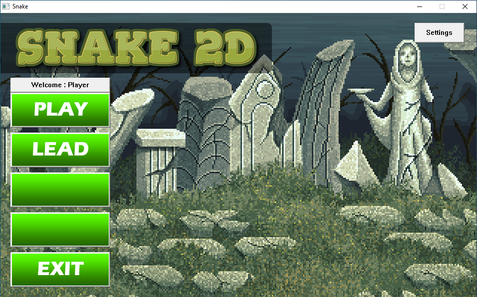
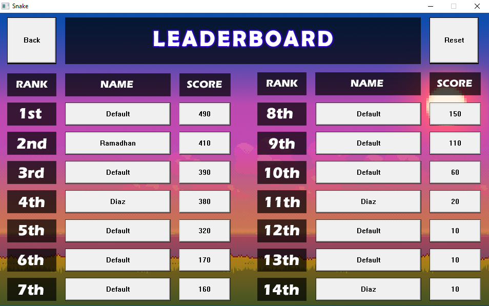

# Snake Game (Kelompok 14)

Dibuat oleh :
Ramadhan Kalih Sewu (1806148826) dan
Diaz Ilyasa Azrurrafi Saiful (1806200154)

## User Interface
- Windows Application using WinApi <windows.h>
- Based on Button and Mouse click Event
- Minimalist Design



### Register Main Window Class
```bash
    WNDCLASSEXW wcex;
    
    wcex.cbSize         = sizeof(WNDCLASSEX);
    wcex.style          = 0;
    wcex.lpfnWndProc    = MainProc;
    wcex.cbClsExtra     = 0;
    wcex.cbWndExtra     = 0;
    wcex.hInstance      = hInstance;
    wcex.hIcon          = LoadIcon(hInstance, MAKEINTRESOURCE(IDI_ICON));
    wcex.hCursor        = LoadCursor(NULL, IDC_ARROW);
    wcex.hbrBackground  = (HBRUSH)(COLOR_WINDOW+1);
    wcex.lpszMenuName   = NULL;
    wcex.lpszClassName  = MainClass;
    wcex.hIconSm        = LoadIcon(NULL, IDI_APPLICATION);

    return RegisterClassExW(&wcex);
```

### Create Main Window Class
```bash
    hInst = hInstance; // Store instance handle in our global variable
    center_window(GetDesktopWindow(), 960, 600);
    hWnd = CreateWindowW   (MainClass, "Snake", WS_SYSMENU | WS_MINIMIZEBOX,
                            rect.left, rect.top, 960, 600,
                            NULL, NULL, hInstance, NULL);
    if (!hWnd)
    {
        return FALSE;
    }
    ShowWindow(hWnd, nCmdShow);
    UpdateWindow(hWnd);
    return TRUE;
```

## Cakupan Program
- Linked-List Data Structure (Import and Export Player Scores)
- Pointer and Long Pointer (LPCSTR) used by Windows
- Bubble Sort (Sort player scores to justify the Leaderboard) 



### Encrypt
- View

```bash
    struct node 
    {
        char name[16];
        int point;
        struct node *next;
    } *rear, *temp;

    // Generate Node pointer
    struct node *head = NULL;
    struct node *current = NULL;

    //Create Linked List
    void insert(char *user, int point)
    {
       // Allocate memory for new node;
       struct node *link = (struct node*) malloc(sizeof(struct node));
       // Set value
       strcpy(link->name, user);
       link->point = point;
       link->next = NULL;

       // If head is empty, create new list
       if(head==NULL)
       {
          head = link;
          return;
       }
       current = head;
       // move to the end of the list
       while(current->next!=NULL)
           current = current->next;
       // Insert link at the end of the list
       current->next = link;
    }
```

### Decrypt
- Feature

- View

```bash
      for(i = 0; (i < sz && str[i] != '\0'); i++)
      {
        if (i<2)
            str[i] = str[i] - 3;
        else if (i<4)
            str[i] = str[i] - 5;
        else if (i<6)
            str[i] = str[i] - 11;
        else if (i<8)
            str[i] = str[i] + 7;
        else if (i<10)
            str[i] = str[i] + 10;
        else if (i>=10)
            str[i] = str[i] - 1 - i;
      }
```

### Write or Read Files
```bash
        //Ambil nama File
        mvwprintw(inputwin, 1, 1, "Simpan dengan nama file: ");
        wrefresh(inputwin);
        wgetstr(inputwin, filename);

        //Specify path
        char cwd[PATH_MAX];
        getcwd(cwd, sizeof(cwd));
        dirname = "myaccount";
        sprintf(filepath, "%s\\%s\\%s.mya", cwd, dirname, filename);

        //Exporting File
        fptr = fopen(filepath, "w"); //W to Write, R to Read
 ```
 
 ### Create Bank Password
- View

- Security Question

- File Encrypted


### Manage Bank Password
- Prove File Authentication

- View
You can Edit existing data , Add new Data, Change page view, Save changes to the file. 

